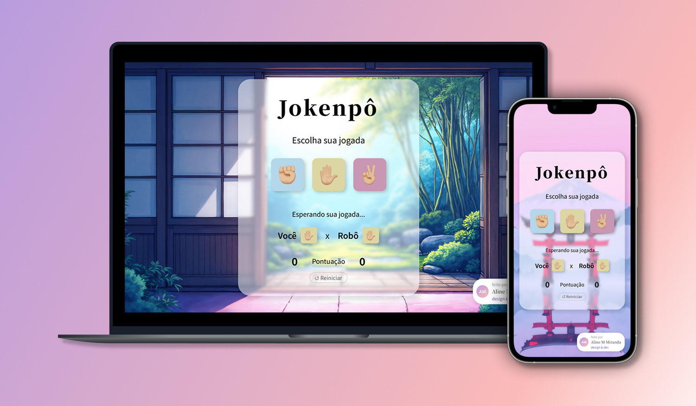

# じゃんけんぽん — JoKenPô

> Jogo de **Pedra, Papel e Tesoura** com visual estilo japonês, splash screen animada e fundos dinâmicos.

🔗 [Ver projeto online](https://aline-mmiranda.github.io/jokenpo/)



---

## 📖 Sobre o Projeto

**JoKenPô** é uma aplicação web do clássico jogo de mãos, inspirada na versão japonesa *じゃんけんぽん*. O jogador enfrenta um robô em rodadas rápidas, com interface glassmorphism, troca automática de planos de fundo e animações suaves.

Projeto desenvolvido por [Aline M Miranda](https://github.com/aline-mmiranda).

---

## 🎮 Como Jogar

1. Aguarde a splash screen carregar
2. Escolha sua jogada clicando em um dos ícones:

| Jogada | Vence de | Perde para |
|--------|----------|------------|
| ✊ Pedra | ✌️ Tesoura | ✋ Papel |
| ✋ Papel | ✊ Pedra | ✌️ Tesoura |
| ✌️ Tesoura | ✋ Papel | ✊ Pedra |

3. Veja o resultado e o placar atualizar em tempo real
4. Use o botão **↺ Reiniciar** para zerar o placar quando quiser

---

## 🚀 Funcionalidades

- 🌸 **Splash screen** com barra de progresso animada e título em japonês
- 🖼️ **Troca automática de planos de fundo** a cada 60 segundos com transição suave
- 🃏 **Animação de giro** nas imagens enquanto aguarda a jogada
- 🤖 **Oponente robô** com escolha aleatória
- 🏆 **Placar em tempo real** para jogador e robô
- 🎨 **Interface glassmorphism** com blur e transparência
- ♿ **Acessibilidade** com atributos `aria-label` e `aria-live`
- 📱 **Layout responsivo** para dispositivos móveis

---

## 🛠️ Tecnologias

| Tecnologia | Uso |
|------------|-----|
| HTML5 | Estrutura semântica da página |
| CSS3 | Glassmorphism, animações, responsividade |
| JavaScript (Vanilla) | Lógica do jogo, DOM, eventos |
| Google Fonts | Noto Sans JP · Noto Serif JP |

> Projeto 100% front-end — sem frameworks, sem dependências externas.

---

## 📁 Estrutura do Projeto

```
jokenpo/
├── assets/
│   ├── rock.png
│   ├── paper.png
│   ├── scissors.png
│   ├── bg1.jpg … bg9.jpg
├── index.html      # Estrutura e marcação da página
├── style.css       # Estilização, glassmorphism e responsividade
├── script.js       # Lógica do jogo, splash, backgrounds e animações
└── README.md
```

---

## ▶️ Como Executar

Por ser um projeto estático, basta abrir o `index.html` no navegador:

```bash
# Clone o repositório
git clone https://github.com/aline-mmiranda/jokempo.git

# Acesse a pasta
cd jokempo

# Abra no navegador (ou use uma extensão como Live Server no VS Code)
open index.html
```

> **Dica:** use a extensão **Live Server** do VS Code para hot reload durante o desenvolvimento.

---

## 🤝 Contribuindo

Contribuições são bem-vindas!

1. Faça um **fork** do projeto
2. Crie uma branch: `git checkout -b feature/minha-feature`
3. Commit suas mudanças: `git commit -m 'feat: descrição da feature'`
4. Push: `git push origin feature/minha-feature`
5. Abra um **Pull Request**

---

## 👩‍💻 Autora

Feito com ❤️ por **Aline M Miranda**

[](https://www.linkedin.com/in/aline-mmiranda/)
[](https://github.com/aline-mmiranda)

---

<p align="center">じゃんけんぽん ✊✋✌️</p>
